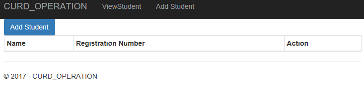
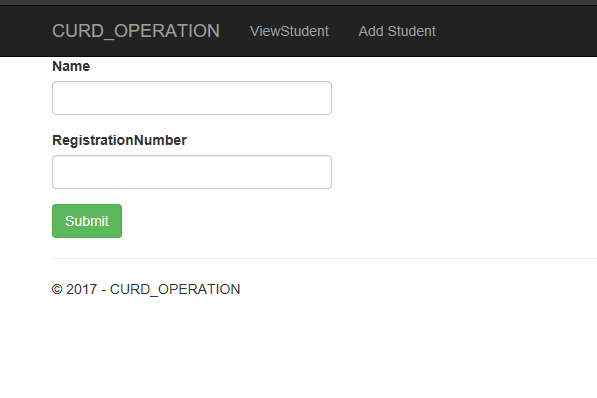
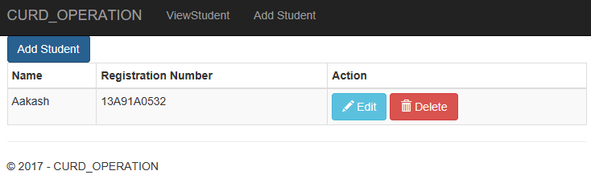
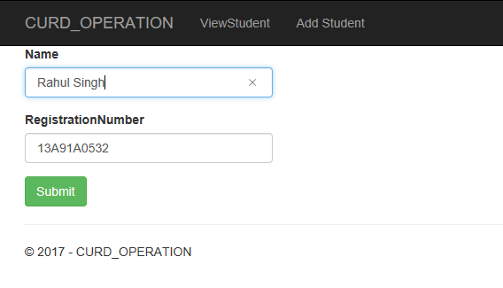

## What is this post about?

In this article I am going to explain about how we can perform create , update , read and delete operation in asp.net core mvc using entity framework core.

You guys can download the full source code from Github. [Download Link](https://github.com/iAmBipinPaul/CrudAspNetCore)


### Let’s start ……

First Open Visual Studio 2015 ,click on new project and under visual c# section click web and select .Net core application give CURD_OPERATION name to that web app and then click ok after this chose Web Application and make sure no authentication is selected in the right side. after that we have to create model , view and controller action for Create , Read , Update and Delete operation.

Create a Folder name Models and add new class Student.cs with property Id, name and RegistrationNumber as shown in the below code.

```csharp
public class Student
{
public int ID { get; set; }
[Required]
[StringLength(255, MinimumLength =5)]
public string Name { get; set; }
[Required]
[StringLength(10, MinimumLength = 5)]
public string RegistrationNumber { get; set; }
}
```

after creating a model we have to create DbContext to so that we can save that to the database and create a migration for the Student Model.

Create a new class with name StudentDBContext.cs , Keep in mind that Context is necessary for in the name we have to Context Keyword while giving a name to the Context class . and that Context class should be drived form DbContext class.

```csharp
using Microsoft.EntityFrameworkCore;
namespace CURD_OPERATION.Models
{
public class StudentDBContext : DbContext
{
public StudentDBContext(DbContextOptions<StudentDBContext> options)
: base(options)
{ }
public DbSet<Student> Students { get; set; }
}
}
```

Now open the Project.json file and we need to add the few Dependencies to the file so that we can use the Entity framework and the tools related to the Entity framework . add the following dependeceisn in the project.json file.

Depeendecies Section

```json
"Microsoft.EntityFrameworkCore.SqlServer": "1.0.1",
"Microsoft.EntityFrameworkCore.SqlServer.Design": {
"version": "1.0.1",
"type": "build"
},
"Microsoft.EntityFrameworkCore.Tools": {
"version": "1.0.0-preview2-final",
"type": "build"
}
```
Tools section

```json
"Microsoft.EntityFrameworkCore.Tools": "1.0.0-preview2-final"
```

After this we need to add the Entity Framework and and StudentDBContext.cs file in the Startup.cs so that application will know about the database and Context file. Open start up and add the flowing line of code in the function 
```public void ConfigureServices(IServiceCollection services)```
 as shown below.

 ```csharp
 public void ConfigureServices(IServiceCollection services)
{
// Add framework services.
var connection = "Server=(localdb)\\ProjectsV13;Database=StudenDB;Trusted_Connection=true;MultipleActiveResultSets=true";
services.AddDbContext<StudentDBContext>(options => options.UseSqlServer(connection));
services.AddApplicationInsightsTelemetry(Configuration);
services.AddMvc();
}
```

Now after all this we have to execute some entity framework core commands to add the migration and create the database table.Open the command prompt and go to the project file location and type ```dotnet ef``` and hit enter after that type ```dotnet ef migration add [migrationname]``` and hit enter after this type ```dotnet ef database update``` and hit enter .This will create a database table for your schema.

till now we have created database and configured that in our database but we haven't added anything that will perform CURD operation lets do some task so that we can we can perform the CURD operation. in the controller folder open the HomeController.cs and create a constructor using which we can inject the StudentDBContext so that we can work with the data and same that to the database and also add some IActionResult method with will return the view ,

```csharp
namespace CURD_OPERATION.Controllers
{
public class HomeController : Controller
{
private StudentDBContext _context;
public HomeController(StudentDBContext context)
{
_context = context;
}
[HttpGet]
public IActionResult AddStudent()
{
ViewData["Message"] = "Your application description page.";
return View();
}
[HttpPost]
public IActionResult AddStudent(Student newStudent)
{
if(ModelState.IsValid)
{
_context.Add(newStudent);
_context.SaveChanges();
ModelState.Clear();
}
return RedirectToAction("ViewStudent");
}
public IActionResult ViewStudent()
{
var a = _context.Students;
return View(a);
}
[HttpGet]
public IActionResult EditStudent(long id)
{
Student student = _context.Set<Student>().SingleOrDefault(c => c.ID == id);
return View(student);
}
[HttpPost]
public IActionResult EditStudent(long id,Student newStudent)
{
Student student = _context.Set<Student>().SingleOrDefault(c => c.ID == id);
_context.Set<Student>().SingleOrDefault(s => s.ID == id);
student.Name = newStudent.Name;
student.RegistrationNumber = newStudent.RegistrationNumber;
_context.SaveChanges();
return RedirectToAction("ViewStudent");
}
[HttpGet]
public IActionResult DeleteStudent(long id)
{
Student student = _context.Set<Student>().SingleOrDefault(c => c.ID == id);
return View(student);
}
[HttpPost]
public IActionResult DeleteStudent(long id, FormCollection form)
{
Student student = _context.Set<Student>().SingleOrDefault(c => c.ID == id);
_context.Entry(student).State = Microsoft.EntityFrameworkCore.EntityState.Deleted;
_context.SaveChanges();
return RedirectToAction("ViewStudent");
}
public IActionResult Error()
{
return View();
}
}
}
```

After this we need to create View for each IActionResult Method in the folder `Views/Home` .
View for `AddStudent()` method.

```html
@model CURD_OPERATION.Models.Student
@{
ViewData["Title"] = "Add Student";
}
<h2>@ViewData["Title"].</h2>
<h3>@ViewData["Message"]</h3>
<p>Use this area to provide additional information.</p>
<form method="post"  enctype="multipart/form-data" >
<div>
<div class="form-group">
<label asp-for="Name"></label>
<input class="form-control" asp-for="Name" />
</div>
<div class="form-group">
<label asp-for="RegistrationNumber"></label>
<input class="form-control" asp-for="RegistrationNumber" />
</div>
<button type="submit" class="btn btn-success">Submit</button>
</div>
</form>
```

View for `DeleteStudent()` method

```html
@model CURD_OPERATION.Models.Student
<div>
<center>
<form method="post">
<label>Are you sure you wann delete this Student</label>
<p >@Model.Name</p>
<button type="submit" asp-route-id="@Model.ID" class="btn btn-danger">Yes</button>
</form>
</center>
</div>
```

View for `EditStudent()` method

```html
@model CURD_OPERATION.Models.Student
@*
For more information on enabling MVC for empty projects, visit http://go.microsoft.com/fwlink/?LinkID=397860
*@
@{
}
<div class="form-group">
<form method="post">
<div class="form-group">
<label asp-for="Name" ></label>
<input asp-for="Name" class="form-control" />
</div>
<div class="form-group">
<label asp-for="RegistrationNumber"></label>
<input asp-for="RegistrationNumber" class="form-control" />
</div>
<button class="btn btn-success" asp-route-id="@Model.ID">Submit</button>
</form>
</div>
```
View for `ViewStudent()` method

```html
@model IEnumerable<CURD_OPERATION.Models.Student>
@*
For more information on enabling MVC for empty projects, visit http://go.microsoft.com/fwlink/?LinkID=397860
*@
@{
}
<a asp-controller="Home" asp-action="AddStudent" class="btn btn-primary">Add Student</a>
<table class="table table-bordered table-striped table-condensed">
<thead>
<tr>
<th>Name</th>
<th>Registration Number</th>
<th>Action</th>
</tr>
</thead>
<tbody>
@foreach (var item in Model)
{
<tr>
<td>@Html.DisplayFor(modelItem => item.Name)</td>
<td>@Html.DisplayFor(modelItem => item.RegistrationNumber)</td>
<td>
<a asp-action="EditStudent" asp-route-id="@item.ID"
class="btn btn-info">
<i class="glyphicon glyphicon-pencil"></i>  Edit
</a>
<a    asp-action="DeleteStudent" asp-route-id="@item.ID" class="btn btn-danger">
<i class="glyphicon glyphicon-trash"></i>  Delete
</a>
</td>
</tr>
}
</tbody>
</table>
```
After this I configured my Default Route in Startup.cs file. default controller as Home and Default action as ViewStudent so that while running the app it will open ViewStudent Section.

```csharp
app.UseMvc(routes =>
{
routes.MapRoute(
name: "default",
template: "{controller=Home}/{action=ViewStudent}/{id?}");
});
```
After this run the application , You will get the page like this .

### View Student page



Click on Add Student you will get a page as shown below fill the name and Registration number and click on submit button.

### Add Student Page



After submitting the form you will get a page like below



Click on edit page you will get an edit page as shown below



After editing and submitting you will be redirected to the View Student page and while clicking on Delete option in View Student Page you will get any option like below.


> Here in the delete and add Student section you can add an button as `<a asp-controller="Home"  asp-action="ViewStudent" class="btn">Cancel</a>`
> and it will redirect to View student page in order to cancel that operation. In the production area you must
> have to add such thing to cancel the particular operation

*Feel free to comment and give suggestion.*