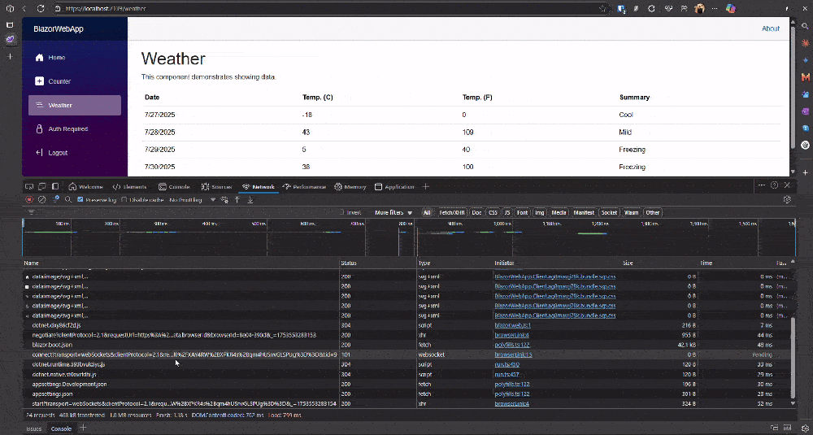

## Introduction

If you are a .NET developer and developing apps with Blazor, you know it's awesome. However, for SEO or making first page load faster, Server Side Rendering is necessary. Blazor WebAssembly interactive with prerender set to true makes this possible, meaning the same component can be rendered on both the server side and the client side.

When our app has authentication, if the page renders on the server side, we need to have that authentication state available on both the server side and client side. This way, if we are logged in and do a hard refresh, the server side will still render the page as if we are logged in.

In this article, I am going to explain how we can manage the same authentication state for users on both client side and server side.


here is the project structure and the follow

1. we have `Auth.Api` which generates JWT token and have secured endpoint which blazor app will consume
2. `BlazorWebApp` and `BlazorWebApp.Client` Blazor Web App, which Blazor Web App `BlazorWebApp` is server project and `BlazorWebApp.Client` is client project
3. `ApiAndBlazorWebAppShared` is shared project which have shared model/class between `Auth.Api` and `BlazorWebApp/BlazorWebApp.Client`

## Authentication Flow Challenge

Our Blazor app needs to call `Auth.Api` to get a JWT token and then use that token to access secured endpoints. From our component, we can directly call `Auth.Api` to get the JWT token and use it to access secured endpoints, which works perfectly fine initially.

However, when we navigate to a secure page and perform a hard refresh, copy the link to open in a new tab, or duplicate the tab, we won't see the result immediately. This happens because the BlazorServer app doesn't have access to the JWT token, so when rendering the page on the server side, it cannot authenticate and render the page properly. Instead, it will redirect to the login page, then check for locally stored JWT tokens, and finally make calls from the client side to secured endpoints using the locally stored JWT token.

When we refresh the page, there is no Blazor app or code running that can pass the token to the server side for page rendering. This is where cookies come in handy. Cookies work like this: whenever we set a cookie for a website, the browser always sends that cookie to the URL when it calls the server side or loads a page for that URL.

## The Solution

Instead of calling `Auth.Api` directly from the Blazor client side, we'll make a call to an endpoint on `BlazorWebApp`, which will then call `Auth.Api` to get the JWT token. This endpoint will set the JWT token in a cookie and also return it in the response to the caller (client app). Our client app will save that token in local storage.

By saving the same JWT token in both a cookie and local storage, we ensure that when making calls from the client app, it will read the token from local storage. When making calls from the server side, it will read the token from the cookie and use it to access secured endpoints of `Auth.Api` and also to provide authentication state to the Blazor app.

## Token Service Implementation

### Endpoint on `BlazorWebApp` to Get JWT Token

This endpoint gets the JWT token, sets it in a cookie, and returns it to the caller (BlazorWebApp.Client):

> We have an `ITokenStoreService` interface that handles storing tokens, clearing tokens, and getting tokens from cookies on the server side. On the client side, the same interface uses Blazor local storage for these operations.

```csharp
//Program.cs in BlazorWebApp
app.MapPost("/tokens/create", async ([FromBody] TokenRequestInput request, ITokenStoreService tokenStoreService, HttpContext context, [FromServices] IHttpClientFactory clientFactory) =>
{
    var response = await clientFactory.CreateClient("API").PostAsync($"/tokens/create",
        JsonContent.Create(request));

    var tokenResponse = await response.Content.ReadFromJsonAsync<TokenResponse>();
    if (tokenResponse == null)
        throw new InvalidDataException();
    await tokenStoreService.SetToken(tokenResponse.Token);
    return TypedResults.Ok(tokenResponse);
});

```

### Logout Functionality

For logout, we make a call to the logout endpoint on `BlazorWebApp` which clears the token from the cookie. After that request succeeds, we also remove it from our local storage.

#### Endpoint on `BlazorWebApp` to Logout and Clean Cookie
```csharp
//Program.cs in BlazorWebApp`
app.MapPost("/tokens/logout", async (ITokenStoreService tokenService) =>
{
    await tokenService.ClearCacheAsync();
    return TypedResults.Ok();
});
```

## UI Components Implementation

### Login Component

The component on the UI side `(Login.razor, Login.razor.cs)` that calls the endpoint on `BlazorWebApp` to get the token and save it to local storage:

```csharp
// Login.razor.cs in BlazorWebApp.Client
 private async Task HandleLogin()
 {
     if (string.IsNullOrEmpty(ReturnUrl))
     {
         var uri = new Uri(navigationManager.Uri);
         ReturnUrl = uri.PathAndQuery;
     }
     var client = httpClientFactory.CreateClient("BFF");
     var response = await client.PostAsJsonAsync("/tokens/create", tokenRequestInput);
     if (response.IsSuccessStatusCode)
     {
         TokenResponse tokenResponse = await response.Content.ReadFromJsonAsync<TokenResponse>();

         await tokenStoreService.SetToken(tokenResponse.Token);
         loginErrorMessage = null;
         if (!string.IsNullOrWhiteSpace(ReturnUrl) && !ReturnUrl.Contains("/login", StringComparison.InvariantCultureIgnoreCase))
         {
             navigationManager.NavigateTo(ReturnUrl);
         }
         else
         {
             navigationManager.NavigateTo("/");
         }
     }
     else
     {
         loginErrorMessage = "Login failed. Please check your credentials.";
     }
 }
```
### Logout Component

The component on the UI side `(Logout.razor, Logout.razor.cs)` that calls the endpoint on `BlazorWebApp` to logout and clear the token from local storage:

```csharp
// Logout.razor.cs in BlazorWebApp.Client
 protected override async Task OnInitializedAsync()
 {
     var client = httpClientFactory.CreateClient("BFF");
     await client.PostAsync("/tokens/logout", null);
     await tokenStoreService.ClearCacheAsync();
     if (!string.IsNullOrWhiteSpace(ReturnUrl) && !ReturnUrl.Contains("/logout", StringComparison.InvariantCultureIgnoreCase))
     {
         navigationManager.NavigateTo(ReturnUrl);
     }
     else
     {
         navigationManager.NavigateTo("/");
     }
 }
```

## Authentication State Provider

Up until now, we have just talked about getting tokens and storing them in cookies and local storage. However, we also need to provide authentication state to the Blazor app itself, and we need to provide this on both the client side and server side.

### Client-Side Authentication State Provider

Here is the `AuthenticationStateProvider` in `BlazorWebApp.Client` which provides authentication state on the client side:
```csharp
// UIAuthenticationStateProvider.cs in BlazorWebApp.Client
  public class UIAuthenticationStateProvider : AuthenticationStateProvider
 {
     private readonly ITokenStoreService _authenticationService;
     private readonly PersistentComponentState _persistentState;
     private bool _isInitialLoad = true;

     public UIAuthenticationStateProvider(ITokenStoreService authenticationService, PersistentComponentState persistentState)
     {
         _authenticationService = authenticationService;
         _persistentState = persistentState;

         authenticationService.LoginChange += name =>
         {
             NotifyAuthenticationStateChanged(GetAuthenticationStateAsync());
         };
     }

     public override async Task<AuthenticationState> GetAuthenticationStateAsync()
     {
         // On the very first load, try to get the user from the persisted state.
         if (_isInitialLoad && _persistentState.TryTakeFromJson<AppUser>(nameof(AppUser), out var userInfo) && userInfo is not null)
         {
             _isInitialLoad = false;
             var claimsPrincipal = new ClaimsPrincipal(CreateIdentityFromUserInfo(userInfo));
             return new AuthenticationState(claimsPrincipal);
         }
         string cachedToken = await _authenticationService.GetToken();
         if (string.IsNullOrWhiteSpace(cachedToken))
         {
             return new AuthenticationState(new ClaimsPrincipal(new ClaimsIdentity()));
         }
         // Generate claimsIdentity from cached token
         var claimsIdentity = new ClaimsIdentity(GetClaimsFromJwt(cachedToken), "jwt");
         return new AuthenticationState(new ClaimsPrincipal(claimsIdentity));
     }

     private static ClaimsIdentity CreateIdentityFromUserInfo(AppUser userInfo)
     {
         var claims = new List<Claim>
     {
         new(ClaimTypes.NameIdentifier, userInfo.Id),
         new(ClaimTypes.Email, userInfo.Email ?? string.Empty),
         new(ClaimTypes.GivenName, userInfo.FirstName ?? string.Empty),
         new(ClaimTypes.Surname, userInfo.LastName ?? string.Empty),
         new(ClaimTypes.Name, userInfo.FirstName ?? string.Empty),
     };

         return new ClaimsIdentity(claims, "PersistentAuth");
     }

     private IEnumerable<Claim> GetClaimsFromJwt(string jwt)
     {
         var claims = new List<Claim>();
         string payload = jwt.Split('.')[1];
         byte[] jsonBytes = ParseBase64WithoutPadding(payload);
         var keyValuePairs = JsonSerializer.Deserialize<Dictionary<string, object>>(jsonBytes);

         if (keyValuePairs is not null)
         {
             keyValuePairs.TryGetValue(ClaimTypes.Role, out object? roles);

             if (roles is not null)
             {
                 string? rolesString = roles.ToString();
                 if (!string.IsNullOrEmpty(rolesString))
                 {
                     if (rolesString.Trim().StartsWith("["))
                     {
                         string[]? parsedRoles = JsonSerializer.Deserialize<string[]>(rolesString);

                         if (parsedRoles is not null)
                         {
                             claims.AddRange(parsedRoles.Select(role => new Claim(ClaimTypes.Role, role)));
                         }
                     }
                     else
                     {
                         claims.Add(new Claim(ClaimTypes.Role, rolesString));
                     }
                 }

                 keyValuePairs.Remove(ClaimTypes.Role);
             }

             claims.AddRange(keyValuePairs.Select(kvp => new Claim(kvp.Key, kvp.Value.ToString() ?? string.Empty)));
         }

         return claims;
     }

     private byte[] ParseBase64WithoutPadding(string payload)
     {
         payload = payload.Trim().Replace('-', '+').Replace('_', '/');
         string base64 = payload.PadRight(payload.Length + ((4 - (payload.Length % 4)) % 4), '=');
         return Convert.FromBase64String(base64);
     }
 }
```
### Client-Side Service Registration

We also need to register the authentication state provider in our service collection for dependency injection in the BlazorWebApp.Client. Our full Program.cs on the client side looks like this:

```csharp
// Program.cs in BlazorWebApp.Client
using Blazored.LocalStorage;
using BlazorWebApp.Client;
using Microsoft.AspNetCore.Components.Authorization;
using Microsoft.AspNetCore.Components.WebAssembly.Hosting;

var builder = WebAssemblyHostBuilder.CreateDefault(args);

builder.Services.AddAuthorizationCore();
builder.Services.AddCascadingAuthenticationState();
builder.Services.AddScoped<AuthenticationStateProvider, UIAuthenticationStateProvider>(); // Registering  AuthenticationStateProvider

builder.Services.AddBlazoredLocalStorage(); //Services to store token in local storage
builder.Services.AddScoped<ITokenStoreService, TokenStoreService>(); // Service to manage token storage

builder.Services.AddAPIHttpClient();// Register HttpClient for API calls on `Auth.Api` side
builder.Services.AddBFFHttpClient(); // Register HttpClient for Blazor Web App BFF calls to get token and logout and set and clear values from cookie

await builder.Build().RunAsync();
```

## Server-Side Authentication

On the server side, before our Blazor app renders, it hits ASP.NET Core middleware and authentication state checks happen there before further processing. We can use the same approach to validate JWT tokens that we use in standard ASP.NET Core apps, and then provide authentication state to the Blazor app.

Here is the logic to validate JWT tokens in the Blazor app as ASP.NET Core middleware. We register it and then use it in the middleware pipeline:
```csharp
// Program.cs in BlazorWebApp'
builder.Services.AddAuthentication(JwtBearerDefaults.AuthenticationScheme)
    .AddJwtBearer(options =>
    {
        var jwtKey = builder.Configuration["Jwt:Key"] ?? throw new InvalidOperationException("JWT Key not configured");
        byte[] key = Encoding.ASCII.GetBytes(jwtKey);

        options.RequireHttpsMetadata = false;
        options.SaveToken = true;
        options.TokenValidationParameters = new TokenValidationParameters
        {
            ValidateIssuerSigningKey = true,
            IssuerSigningKey = new SymmetricSecurityKey(key),
            ValidateIssuer = false,
            ValidateAudience = false,
            ValidateLifetime = true,
            RoleClaimType = ClaimTypes.Role,
            ClockSkew = TimeSpan.Zero
        };

        options.Events = new JwtBearerEvents
        {
            OnMessageReceived = context =>
            {
                context.Token = context.Request.Cookies[StorageConstants.Local.AuthToken];
                return Task.CompletedTask;
            },

            OnChallenge = context =>
            {
                // For browser requests, redirect to the login page instead of returning 401
                context.HandleResponse();
                if (!context.Response.HasStarted)
                {
                    context.Response.Redirect("/login?ReturnUrl=" + Uri.EscapeDataString(context.Request.Path + context.Request.QueryString));
                }

                return Task.CompletedTask;
            }
        };
    });
```

### Server-Side Authentication State Provider

Now we need an authentication state provider on the server side (in the `BlazorWebApp` project):
```csharp
// PersistingServerAuthenticationStateProvider.cs in BlazorWebApp
  public class PersistingServerAuthenticationStateProvider : ServerAuthenticationStateProvider, IDisposable
  {
      private readonly PersistentComponentState _state;
      private readonly PersistingComponentStateSubscription _subscription;
      private Task<AuthenticationState>? _authenticationStateTask;

      public PersistingServerAuthenticationStateProvider(
          PersistentComponentState persistentComponentState)
      {
          _state = persistentComponentState;
          AuthenticationStateChanged += OnAuthenticationStateChanged;
          _subscription = _state.RegisterOnPersisting(OnPersistingAsync, RenderMode.InteractiveWebAssembly);
      }

      private void OnAuthenticationStateChanged(Task<AuthenticationState> task)
      {
          _authenticationStateTask = task;
      }

      private async Task OnPersistingAsync()
      {
          if (_authenticationStateTask is null)
          {
              throw new UnreachableException($"Authentication state not set in {nameof(OnPersistingAsync)}().");
          }
          var authenticationState = await _authenticationStateTask;
          var principal = authenticationState.User;
          if (principal.Identity?.IsAuthenticated == true)
          {
              var userId = principal.FindFirstValue(ClaimTypes.NameIdentifier);
              var email = principal.FindFirstValue(ClaimTypes.Email);
              var firstName = principal.FindFirstValue(ClaimTypes.GivenName);
              var lastName = principal.FindFirstValue(ClaimTypes.Surname);

              _state.PersistAsJson(nameof(AppUser), new AppUser
              {
                  Id = userId,
                  Email = email,
                  FirstName = firstName,
                  LastName = lastName,
              });
          }
      }

      public void Dispose()
      {
          _subscription.Dispose();
          AuthenticationStateChanged -= OnAuthenticationStateChanged;
      }
  }
```
## Securing Components

Now, I have updated the default `Weather.razor` component with the Authorize attribute. Instead of showing locally hard-coded data, it now pulls similar weather data from the `Auth.Api` secured endpoint:


```csharp
 protected override async Task OnInitializedAsync()
 {
     var client = httpClientFactory.CreateClient("API");
     //need to pass bear token to the server
     var token = await tokenStoreService.GetToken();
     if (!string.IsNullOrWhiteSpace(token))
     {
         client.DefaultRequestHeaders.Authorization = new System.Net.Http.Headers.AuthenticationHeaderValue("Bearer", token);
     }
     else
     {
        await tokenStoreService.ClearCacheAsync();
         navigationManager.NavigateTo($"/login?ReturnUrl={Uri.EscapeDataString(navigationManager.Uri)}");
     }

     HttpResponseMessage response;
     try
     {
         response = await client.GetAsync("/weatherforecast");
     }
     catch (Exception ex)
     {
         return;
     }

     if (response.IsSuccessStatusCode)
     {
         forecasts = await response.Content.ReadFromJsonAsync<WeatherForecast[]>();
     }
     else if (response.StatusCode == System.Net.HttpStatusCode.Unauthorized ||
              response.StatusCode == System.Net.HttpStatusCode.Forbidden)
     {
         await tokenStoreService.ClearCacheAsync();
         navigationManager.NavigateTo($"/login?ReturnUrl={Uri.EscapeDataString(navigationManager.Uri)}");
     }
     
 }
```

## How It Works

When we navigate to the `Weather` page and perform a hard refresh, if we are logged in, it will perform server-side rendering of the page and return HTML. This allows us to see the page quickly in the UI. If we are not logged in, it will show the login page, also loading the HTML from the server itself.

## Conclusion

By implementing this approach, we've created a seamless authentication experience that works across both server-side and client-side rendering in our Blazor application. This ensures that users don't have to log in again after page refreshes, and the application maintains its state regardless of how pages are loaded.


> Please check the full source code for the complete implementation, as here we have just covered the main parts of the implementation. You can find the full source code on [GitHub](https://iambip.in/source-code-blazor-ssr-csr-aut)

## Demo



