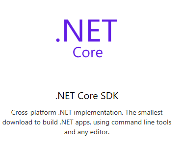

---

title: What are things that a new ASP.NET Core Developer should Master and Learn?
lead: What are things that a new ASP.NET Core Developer should Master and Learn?
published: 2017-11-18
tags: [Microsoft, Aspnetcore, Csharp, Dotnet Core, Web Development]
authors:
    - name: "Bipin Paul"
      gitHubUserName: "iAmBipinPaul"
      xUserName: "iAmBipinPaul"
---

Hi , Everyone\ 
If you are here and reading this article means that you are already familiar with ASP.NET Core and different technologies associated with the ASP.NET Core platform. If you are not familiar with the ASP.NET core please read some article that will make you familiar with ASP.NET Core. Here is the one that I have written.

> [Is it better to get start with ASP.NET core (ASP.NET 5 old name ) as a new Developer?](https://bipinpaul.com.np/posts/Is-it-better-to-get-start-with-ASP.NET-core-as-a-new-Developer)

If you are a recently graduated student or anyone who is planning to switch from other server-side technologies to the ASP.NET Core stack then there are many things you need to master it before you become an expert in this area. Like you guys I also learned ASP.NET Core by watching different tutorials then started developing web application with ASP.NET Core at first it was looking like there whole lots of thing how can I understand that but once you have understood those concepts you will be able to develop simple application easily but when you will work on enterprise level of application there you will have to learn a lot about the technologies that is powering the ASP.NET Core stack and the technologies that is built on the top of ASP.NET Core to enhance the functionality of the ASP.NET Core.

***First let’s talk about the technologies that is powering the ASP.NET Core Stack***

1. ***C# :*** If you want to be a really export in ASP.NET Core , then you have to master the c# , specially the things that are more related to the web apps and stuff. Master Linq of c# which will need to write while performing any action that is related to query or finding
2. ***Entity Framework Core :*** To design and implement better database and relation among them you need to understand about how EF core works and how it is creating the relation among them ,without understanding the concept of EF core you can not design the database as it have to. Your apps works on the top of the database so Database design should be solid and reliable so that in nearby future you can do some changes as per our requirements.

> I listed these two thing in the first because most of the time I’m getting stuck where I have to write Linq
> Query or Define relation among the Class Entity , So based on my personal experience I will suggest everyone to
> master these two technologies.

***let’s talk about the technologies that is enhancing the ASP.NET Core Stack feature and Security***

1. ***openiddict / IdentityServer4 :*** When we are talking about the web app then we can not skip security of the web apps these two technologies ***openiddict*** and ***IdentityServer4*** will help in managing the application in the different circumstance ,the given two technologies are alternative of one another and you don't have to use these normally unless the already existing ASP.NET Core security stack does not full filling your requirements and needs. When you want to connect your app to a centralized security or build a centralized security in that case you may have to use anyone of them, both is **Open-source*** on ***GitHub*** , you can flow that on GitHub to know more and learn more about it.

> Article is written on my personal experience so please feel free to suggest if I’m missing something.You are >
> most welcome to improve this article. Thank you!