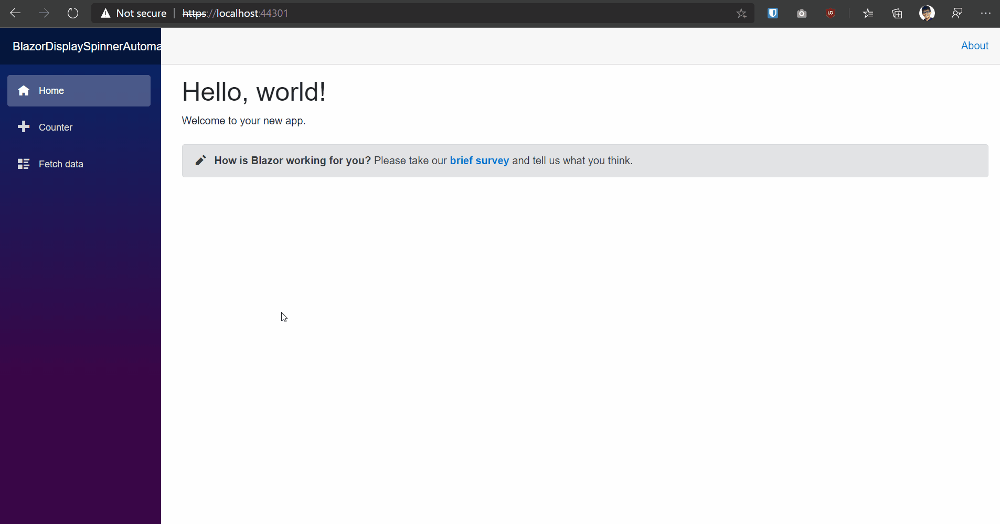

Title: Display spinner on each API call automatically in Blazor
Published: 1/02/2020
Tags:
  - Spinner
  - Blazor
  - Aspnetcore
  - Dotnet
  - webdev
---

### What is Blazor ?

Blazor is a free and open-source web framework that enables developers to create web apps using C# and HTML.

To know more about what blazor and all related stuff  to it visit  [official documentation site](https://blazor.net/).

If you have already up and running blazor application you are good to go along. if not,  visit official documentation to setup and configure blazor on your machine.

> Link of official documentation to get started with Blazor\
> [Get started with Blazor](https://blazor.net/)

We often want to show some loading or spinner on UI when our application is making some request to the server, so that users will know that there are some operation going on and need to wait till that operation is complete, We can handle this manually on each time in our code when there is an API call we can show some loading bar but There is a better way to do this and ie let it show the spinner automatically when there is ongoing API call and we can do this my adding our own custom `HttpMessageHandler` and show  spinner just before sending request and hide that after getting response from the server.


Steps 
1. Create Spinner Service 
2. Create Spinner Component 
3. Create Custom HttpMessageHandler
4. Add Spinner Component in MainLayout
5. Register Services in startup


# Step 1 : Create Spinner Service 

Spinner Service class exposes two methods and two event, which  will work as a communication channel  between other Components (`MainLayout`) and Spinner component

```
public class SpinnerService
	{
		public event Action OnShow;
		public event Action OnHide;

		public void Show()
		{
			OnShow?.Invoke();
		}

		public void Hide()
		{
			OnHide?.Invoke();
		}
	}
```


# Step 2 :  Create Spinner Component 

Here in this Spinner component , I have some css to show the Spinner on top of other html elements and for Spinner I'm using a Blazor Library called `Faso.Blazor.SpinKit` , which we can install from NuGet , It has a different kind of spinner , here I'm using  ` <SpinKitCircle />`.  to know more about this spineer visit [Github Repo](https://github.com/faso/Faso.Blazor.SpinKit) of this this NuGet library.

Here our logic is simple when  `IsVisible` will be `true` it will show the spinner and in the case of `false` it will hide.

From our Spinner service when  `OnShow` event will be fired, `ShowSpinner()` method will be called it will make `IsVisible` `true` same on `OnHide` `HideSpinner()` method will be called and it will make `IsVisible`  `false`.


```
@using Faso.Blazor.SpinKit
@inject SpinnerService SpinnerService

<style>
    .spinner-container {
        display: flex;
        flex-direction: column;
        position: fixed;
        z-index: 999;
        top: 50%;
        left: 50%;
    }
</style>
@if (IsVisible)
{
    <div class="spinner-container">
        <SpinKitCircle />
    </div>
}
@code
{
    protected bool IsVisible { get; set; }
    protected override void OnInitialized()
    {
        SpinnerService.OnShow += ShowSpinner;
        SpinnerService.OnHide += HideSpinner;
    }

    public void ShowSpinner()
    {
        IsVisible = true;
        StateHasChanged();
    }

    public void HideSpinner()
    {
        IsVisible = false;
        StateHasChanged();
    }
}
```


# Step 3 : Create Custom HttpMessageHandler

In order to fire `OnShow` and `OnHide` event each time our application will make request we need to add our own custom `HttpMessageHandler`. (i.e. `BlazorDisplaySpinnerAutomaticallyHttpMessageHandler`)

Here in our custom `HttpMessageHandler` we are injecting `SpinnerService` so that we can call `Show()` and `Hide()` method from custom `HttpMessageHandler` that will fire events.


```
using System.Net.Http;
using System.Threading;
using System.Threading.Tasks;

namespace BlazorDisplaySpinnerAutomatically
{
    public class BlazorDisplaySpinnerAutomaticallyHttpMessageHandler : DelegatingHandler
    {       
        private readonly SpinnerService _spinnerService;
        public BlazorDisplaySpinnerAutomaticallyHttpMessageHandler(SpinnerService spinnerService)
        {
            _spinnerService = spinnerService;
        } 
        protected override async Task<HttpResponseMessage> SendAsync(HttpRequestMessage request, CancellationToken cancellationToken)
        {
            _spinnerService.Show();
          //  await Task.Delay(1000);
            var response = await base.SendAsync(request, cancellationToken);
            _spinnerService.Hide();
            return response;            
        }
    }
}
```

# Step 4 : Add Spinner Component in MainLayout 

`MainLayout` is component which will be rendered for each component so we will  add our `Spinner` component on our `MainLayout` Component.

```
<Spinner></Spinner>

<div class="sidebar">
    <NavMenu />
</div>

<div class="main">
    <div class="top-row px-4">
        <a href="http://blazor.net" target="_blank" class="ml-md-auto">About</a>
    </div>

    <div class="content px-4">
        @Body
    </div>
</div>

```

# Step 5 : Register Services in startup 

Now our final step is to register our services in startup , here we are registering `SpinnerService` , Our Custom `HttpMessageHandler`  (i.e. `BlazorDisplaySpinnerAutomaticallyHttpMessageHandler`)  and Also we need to register `HttpClient` and pass our custom `HttpMessageHandler` as `InnerHandler`.

```
 public void ConfigureServices(IServiceCollection services)
        {
           services.AddScoped<SpinnerService>();
            services.AddScoped<BlazorDisplaySpinnerAutomaticallyHttpMessageHandler>();
            services.AddScoped(s =>
            {
                var blazorDisplaySpinnerAutomaticallyHttpMessageHandler = s.GetRequiredService<BlazorDisplaySpinnerAutomaticallyHttpMessageHandler>();
                var wasmHttpMessageHandlerType = Assembly.Load("WebAssembly.Net.Http").GetType("WebAssembly.Net.Http.HttpClient.WasmHttpMessageHandler");
                var wasmHttpMessageHandler = (HttpMessageHandler)Activator.CreateInstance(wasmHttpMessageHandlerType);
               
                blazorDisplaySpinnerAutomaticallyHttpMessageHandler.InnerHandler = wasmHttpMessageHandler;
                var uriHelper = s.GetRequiredService<NavigationManager>();
                return new HttpClient(blazorDisplaySpinnerAutomaticallyHttpMessageHandler)
                {
                    BaseAddress = new Uri(uriHelper.BaseUri)
                };
            });
        }
```

Now run the application , you should see a spinner ,when application  will make http calls.



We can show that spinner from other components as well  when ever we need to show, we just has to inject `SpinnerService` and call `Show()` and `Hide()` method to show and hide spinner respectively.

Refrence Links 
1. [Creating a Reusable, JavaScript-Free Blazor Modal](https://www.telerik.com/blogs/creating-a-reusable-javascript-free-blazor-modal)
2. [faso/Faso.Blazor.SpinKit](https://github.com/faso/Faso.Blazor.SpinKit)


Feel free to comment and suggests changes .

Full source code on [iAmBipinPaul/BlazorDisplaySpinnerAutomatically](https://github.com/iAmBipinPaul/BlazorDisplaySpinnerAutomatically)

Happy Coding!
