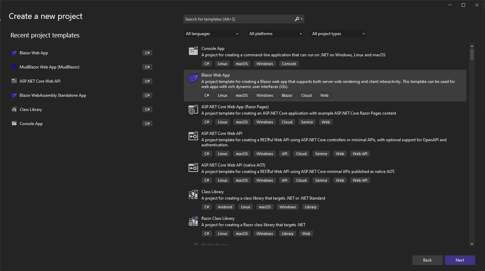
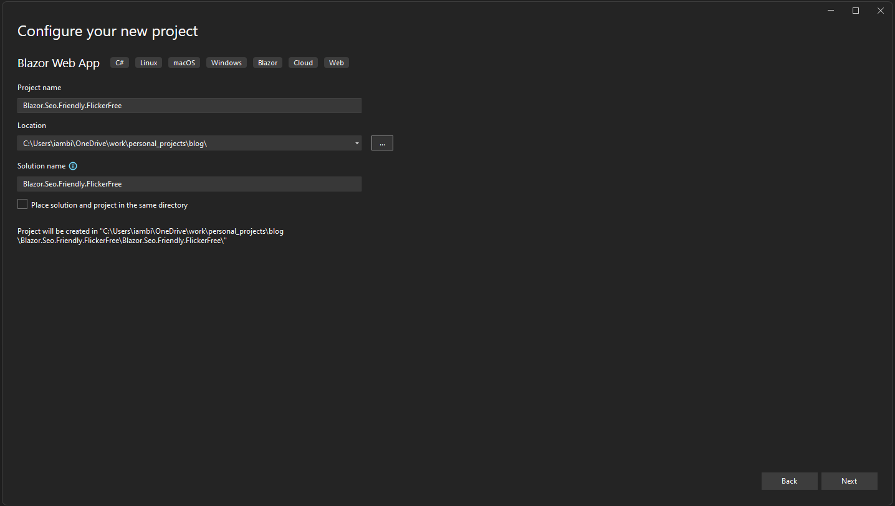
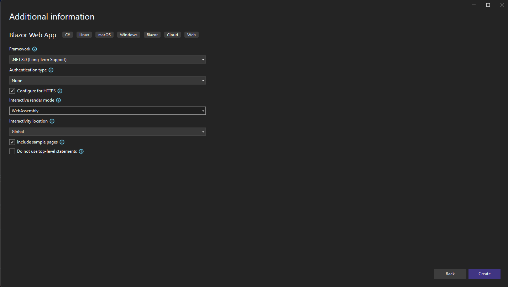

Title: Making Blazor WebAssembly SEO-Friendly and Flicker-Free
Published: 03/26/2024
Tags:
  - ssr
  - Blazor
  - seo
  - prerender
  - prerendering
  - aspnetcore
  - webdev 
  - WebAssembly
---

In this blog post, we will walk through the process of making a Blazor WebAssembly application both SEO-friendly and flicker-free.

## Steps

1. **Create a Blazor App WebAssembly Interactive (Global)**: Start by creating a new Blazor WebAssembly application. Make sure to select the "Interactive (Global)" option.

    
    
    *Figure 1: Selecting the Blazor WebAssembly App project type.*

    
    
    *Figure 2: Naming the new Blazor WebAssembly project.*

    
    
    *Figure 3: Selecting the 'Interactive WebAssembly (Global)' option.*

2. **Detect Bots and Crawlers**: Implement a mechanism in your application to detect if a request is coming from a bot or a crawler. This is important for SEO purposes, as it allows search engine bots to crawl your site more effectively.

Update `App.razor` in Client project with the following new changes:

```csharp
@using Microsoft.Net.Http.Headers
@using System.Text.RegularExpressions
@{
    Boolean isBot = false;
    @inject Microsoft.AspNetCore.Http.IHttpContextAccessor HttpContextAccessor;
    var userAgent = HttpContextAccessor?.HttpContext?.Request.Headers[HeaderNames.UserAgent];
    if (userAgent.HasValue)
    {
        var agent = userAgent.ToString();
        if (!string.IsNullOrWhiteSpace(agent))

        {

            isBot = Regex.IsMatch(
                agent,
                @"bot|crawler|baiduspider|80legs|ia_archiver|voyager|curl|wget|yahoo! slurp|mediapartners-google",
                RegexOptions.IgnoreCase
            );
        }
        else
        {
            isBot = false;
        }
    }
}
```


3. **Adjust Pre-Render Settings Based on Bot Detection**: Once you have implemented bot detection, you can use this information to adjust your pre-render settings. Specifically, you should make pre-rendering `true` or `false` based on whether the request is coming from a `bot` or not. This can help improve the performance of your site for real users.

Before closing the head tag, replace `<HeadOutlet/>` with the following code, so that it will pre-render or not based on the isBot variable.

```csharp
   @if (isBot)
    {
        <HeadOutlet @rendermode="new InteractiveWebAssemblyRenderMode(prerender: true)" />
    }
    else
    {
        <HeadOutlet @rendermode="new InteractiveWebAssemblyRenderMode(prerender: false)" />
    }
```

In the body section, like we did in the heading section, render routes based on the `isBot` flag and pass `isBot` to the route as `CascadingValue.`

```csharp
<CascadingValue Value="isBot">
        @if (isBot)
        {
            <Routes @rendermode="new InteractiveWebAssemblyRenderMode(prerender: true)" />
        }
        else
        {
            <Routes @rendermode="new InteractiveWebAssemblyRenderMode(prerender: false)" />
        }
    </CascadingValue>
    @if (!isBot)
    {
        <script src="_framework/blazor.web.js"></script>
    }
```


Now we have the `isBot` value based on that, if the code is running on the client side we can show a loading string. For that, we can update client-side rendering with one `div` after `Routes` gets rendered.

```csharp 
<Routes @rendermode="new InteractiveWebAssemblyRenderMode(prerender: false)" />
            <div id="webassembly-loading-spinner">
                <p>Loading...</p>
            </div>
```

Once client-side rendering is complete, we need to hide loading. For that, we can use this JavaScript function in the head section of `App.razor.`

```javascript 

 <script>
        (function () {
            window.deleteElementById = function (id) {
                var element = document.getElementById(id);
                element.parentNode.removeChild(element);
            }
        })();
    </script>
```
This is the **final** `App.razor` page.

```csharp

@using Microsoft.Net.Http.Headers
@using System.Text.RegularExpressions
@{
    Boolean isBot = false;
    @inject Microsoft.AspNetCore.Http.IHttpContextAccessor HttpContextAccessor;
    var userAgent = HttpContextAccessor?.HttpContext?.Request.Headers[HeaderNames.UserAgent];
    if (userAgent.HasValue)
    {
        var agent = userAgent.ToString();
        if (!string.IsNullOrWhiteSpace(agent))

        {

            isBot = Regex.IsMatch(
                agent,
                @"bot|crawler|baiduspider|80legs|ia_archiver|voyager|curl|wget|yahoo! slurp|mediapartners-google",
                RegexOptions.IgnoreCase
            );
        }
        else
        {
            isBot = false;
        }
    }
}
<!DOCTYPE html>
<html lang="en">

<head>
    <meta charset="utf-8" />
    <meta name="viewport" content="width=device-width, initial-scale=1.0" />
    <base href="/" />
    <link rel="stylesheet" href="bootstrap/bootstrap.min.css" />
    <link rel="stylesheet" href="app.css" />
    <link rel="stylesheet" href="Blazor.Seo.Friendly.FlickerFree.styles.css" />
    <link rel="icon" type="image/png" href="favicon.png" />
    <script>
        (function () {
            window.deleteElementById = function (id) {
                var element = document.getElementById(id);
                element.parentNode.removeChild(element);
            }
        })();
    </script>
    @if (isBot)
    {
        <HeadOutlet @rendermode="new InteractiveWebAssemblyRenderMode(prerender: true)" />
    }
    else
    {
        <HeadOutlet @rendermode="new InteractiveWebAssemblyRenderMode(prerender: false)" />
    }
</head>

<body>
    <CascadingValue Value="isBot">
        @if (isBot)
        {
            <Routes @rendermode="new InteractiveWebAssemblyRenderMode(prerender: true)" />
        }
        else
        {
            <Routes @rendermode="new InteractiveWebAssemblyRenderMode(prerender: false)" />
            <div id="webassembly-loading-spinner">
                <p>Loading...</p>
            </div>
        }
    </CascadingValue>
    @if (!isBot)
    {
        <script src="_framework/blazor.web.js"></script>
    }
</body>

</html>
```
Now we can update our `<Route>` component to hide the loading bar by invoking the JavaScript function to hide the loading. So, the **final** `Routes.razor` will look like this.

```csharp
@* for some reason we need space here otherwise builds fails with error 'The 'inject` directive must appear at the start of the line', so added this  comment for make build works *@
@inject IJSRuntime jsRuntime;
<Router AppAssembly="typeof(Program).Assembly">
    <Found Context="routeData">
        <RouteView RouteData="routeData" DefaultLayout="typeof(Layout.MainLayout)" />
        <FocusOnNavigate RouteData="routeData" Selector="h1" />
    </Found>
</Router>
@code {
    [CascadingParameter]
    public bool isBot { get; set; }
    protected override async Task OnAfterRenderAsync(bool firstRender)
    {
        if (firstRender && isBot == false)
        {
            await jsRuntime.InvokeVoidAsync("deleteElementById", "webassembly-loading-spinner");
        }
    }
}
```

Now update `MainLayout.razor` page to hide `blazor error ui` if loading on the server. So, the **final** `MainLayout.razor` will look like this.

```csharp

@inherits LayoutComponentBase

<div class="page">
    <div class="sidebar">
        <NavMenu />
    </div>

    <main>
        <div class="top-row px-4">
            <a href="https://learn.microsoft.com/aspnet/core/" target="_blank">About</a>
        </div>

        <article class="content px-4">
            @Body
        </article>
    </main>
</div>

@if (!isBot)
{

    <div id="blazor-error-ui">
        An unhandled error has occurred.
        <a href="" class="reload">Reload</a>
        <a class="dismiss">🗙</a>
    </div>
}
@code {
    [CascadingParameter]
    public bool isBot { get; set; }
}
```

4. **Add Missing AddHttpContextAccessor Service Registration**:Don't forget to register the `HttpContextAccessor` service in your application. This service is necessary for accessing the HTTP context of a request. The **final** `Program.cs` will look like this.

```csharp

using Blazor.Seo.Friendly.FlickerFree.Client.Pages;
using Blazor.Seo.Friendly.FlickerFree.Components;

var builder = WebApplication.CreateBuilder(args);

// Add services to the container.
builder.Services.AddRazorComponents()
    .AddInteractiveWebAssemblyComponents();
builder.Services.AddHttpContextAccessor();
var app = builder.Build();

// Configure the HTTP request pipeline.
if (app.Environment.IsDevelopment())
{
    app.UseWebAssemblyDebugging();
}
else
{
    app.UseExceptionHandler("/Error", createScopeForErrors: true);
    // The default HSTS value is 30 days. You may want to change this for production scenarios, see https://aka.ms/aspnetcore-hsts.
    app.UseHsts();
}

app.UseHttpsRedirection();

app.UseStaticFiles();
app.UseAntiforgery();

app.MapRazorComponents<App>()
    .AddInteractiveWebAssemblyRenderMode()
    .AddAdditionalAssemblies(typeof(Blazor.Seo.Friendly.FlickerFree.Client._Imports).Assembly);

app.Run();

```
## Demo

The following GIF demonstrates the final outcome of the steps described in this guide:


Source Code: [GitHub - AditiKraft/Blazor.Seo.Friendly.FlickerFree](https://iambip.in/Blazor.Seo.Friendly.FlickerFree)

## References

- [Code snippet: Conditional User-Agent logic with Blazor](https://codyanhorn.tech/blog/code-snippet-conditional-user-agent-logic-with-blazor)
- [Display loading progress on Blazor .NET 8 WebAssembly pre-render false](https://stackoverflow.com/questions/77476532/display-loading-progress-on-blazor-net-8-webassembly-pre-render-false)
